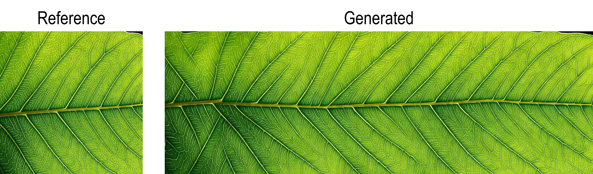
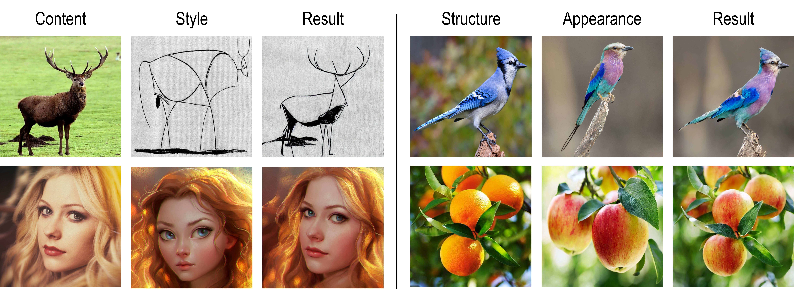
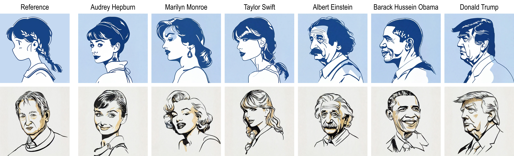

# Attention Distillation: A Unified Approach to Visual Characteristics Transfer


### [Project Page](https://xugao97.github.io/AttentionDistillation/) &ensp; [Paper](https://arxiv.org/abs/2502.20235)


## 🔥🔥  News
* **2025/03/05**: We add `tiling` to enable seamless textures generation. See [Issue 3](https://github.com/xugao97/AttentionDistillation/issues/3) for more details.

* **2025/03/01**: We provide a simple HuggingFace🤗 demo. Check it out [here](https://huggingface.co/spaces/ccchenzc/AttentionDistillation) !


## Setup

This code was tested with Python 3.10, Pytorch 2.5 and Diffusers 0.32.

## Examples
### Texture Synthesis
- See [**Texture Synthesis**] part of [ad] notebook for generating texture images using SD1.5.



### Style/Appearance Transfer
- See [**Style/Appearance Transfer**] part of [ad] notebook for style/appearance transfer using SD1.5.



### Style-specific T2I Generation
- See [**Style-specific T2I Generation**] part of [ad] notebook for style-specific T2I generation using SD1.5 or SDXL.



[ad]: ad.ipynb


### VAE Finetuning

```bash
python train_vae.py \
    --image_path=/path/to/image \
    --vae_model_path=/path/to/vae
```


### Web UI
Run the following command to start the Web UI:
```bash
python app.py
```
The Web UI will be available at [http://localhost:7860](http://localhost:7860).

### ComfyUI
We also provide an implementation of Attention Distillation for ComfyUI. For more details, see [here](https://github.com/zichongc/ComfyUI-Attention-Distillation).